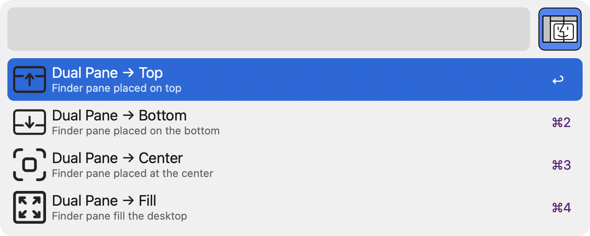
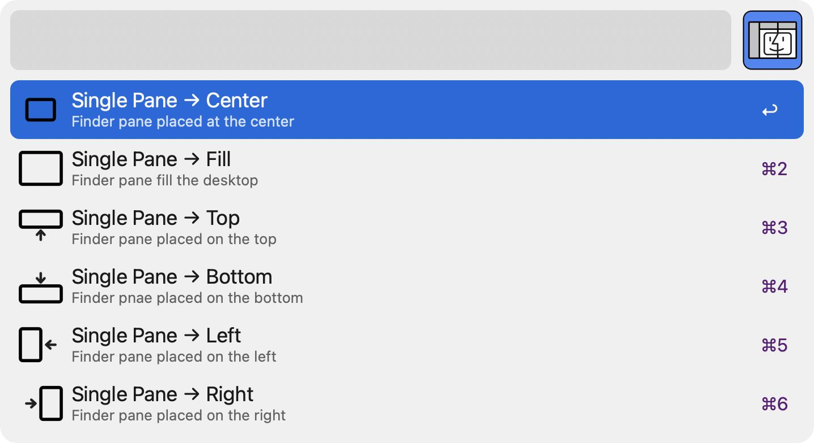
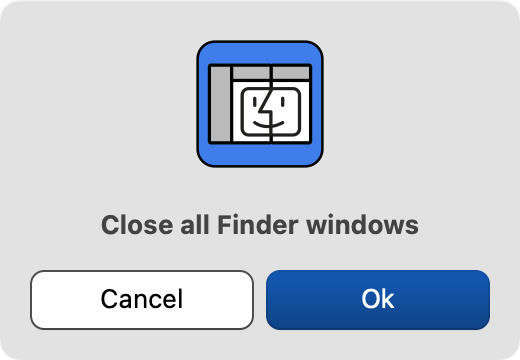
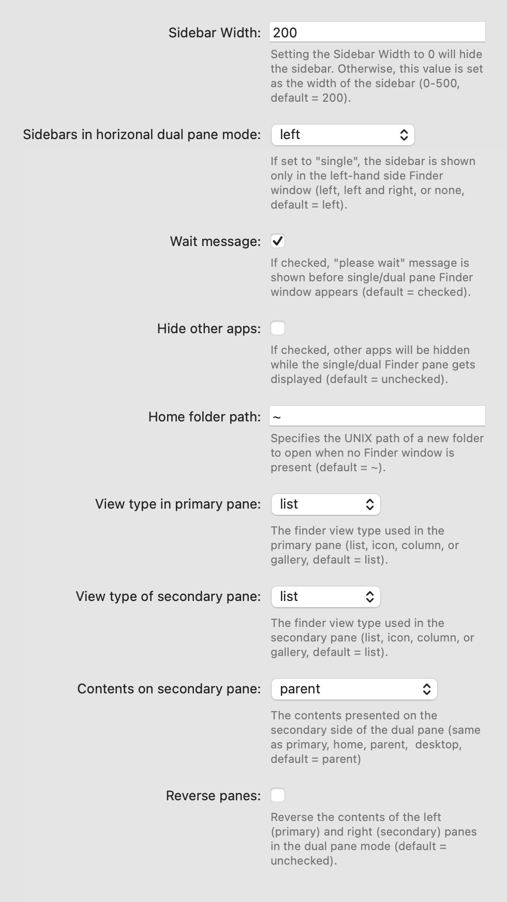

# Finder Unclutter

An Alfred 🎩 workflow that removes duplicate Finder tabs and windows and arranges them into a single or dual-pane 👓 layout for a cleaner desktop experience 🖥️ 🧹


**Finder Unclutter** does the following all at once:

- **Unminimize** all Finder windows
- **Unduplicate** all Finder tabs
- **Merge** all Finder windows and tabs
- **Organize** Finder in a single/dual pane layout
- **Position** Finder in a specified area of the desktop


## Requirements

- [Alfred 5](https://www.alfredapp.com/) with Powerpack

This workflow has been developed and tested on macOS Sonoma and macOS Tahoe.

## Installation

To install, download [Finder Unclutter Alfred Workflow](https://github.com/yohasebe/finder-unclutter/raw/main/finder-unclutter.alfredworkflow) (version 1.7)

## Change Log

- 1.7 (2025-09-22)
  - Center horizontal dual-pane layout now balances both panes by offsetting the left pane with the measured Finder sidebar width.
  - Smart Folder tabs are preserved while transient search results remain excluded when windows are rebuilt.
- 0.1.6 (2025-02-04)
  - Show Desktop menu item added

## Setting up

This Workflow only functions properly if the language setting of Finder.app is set to **English** due to the way it interacts with Finder's interface.

When this Workflow is launched, if the language of Finder.app is not English (`en`), a dialog will be displayed. Clicking OK will automatically change the language setting of Finder.app to English.

&nbsp;&nbsp; 


If you want to revert the language setting of Finder back to its original state, you can do so in macOS's `System Settings` under `Language & Region` / `Applications`. A system restart may be required after changing these settings. Alternatively, you can revert it by executing the following command. Please specify `LANG_CODE` in the [ISO 639-1](https://developer.apple.com/library/archive/documentation/MacOSX/Conceptual/BPInternational/LanguageandLocaleIDs/LanguageandLocaleIDs.html) format as appropriate.

```
defaults write com.apple.Finder AppleLanguages '("LANG_CODE")'; killall Finder
```

## macOS Permissions

On first run macOS prompts for automation access. Approve the dialogs for **Alfred** so it can control **Finder** and **System Events**. If the prompts were dismissed, open `System Settings → Privacy & Security` and enable:

- `Accessibility`: allow Alfred to control the computer.
- `Automation`: under Alfred, check Finder and System Events.

The workflow writes to `com.apple.Finder AppleLanguages` when switching Finder to English and automatically restarts Finder via `killall Finder`.

## Troubleshooting

- Finder still opens in the previous language: rerun the workflow and accept the language change, or manually set Finder to English in `System Settings → Language & Region → Applications`.
- Windows do not merge completely: increase `wait_in_seconds` in the workflow configuration so Finder has more time to reopen slow network or external volumes before merging.
- Automation prompts reappear or automation steps fail: recheck Alfred under `Privacy & Security → Accessibility` and `Automation`, then restart Alfred and Finder.

## Features

Each feature can be assigned a unique hotkey for quick access.

####  Unclutter → Dual-Pane

Organizes Finder tabs/windows into a double-pane Finder window. All existing tabs are collected in the primary pane.

The secondary pane will contain only one tab that displays the user-specified contents (`same as primary`, `parent`, `desktop`, or `home`).

The dual Finder pane can be placed in either `center (horizontal)`, `center (vertical)`, `fill (horizontal)`, `fill (vertical)`, `left`, `right`, `top`, or `bottom`. You can either specify the area either by using hotkeys, or by selecting one on running the workflow.



####  Unclutter → Single-Pane

Finder tabs/windows will be organized into a single Finder window. All existing tabs will be collected in this Finder window.

The dual Finder pane can be placed in either `center`, `fill`, `left`, `right`, `top`, or `bottom`. You can either specify the area either by using hotkeys, or by selecting one on running the workflow.



####  Toggle Show/Hide Finder Windows

This feature relies on Alfreds `toggle visibility` feature.

####  Close Other Tabs and Windows

This will close all the non-current Finder tabs and windows.

####  Close All Finder Windows

This will close all the Finder tabs and windows including the current one. A confirmation dialog pops up.



####  Show Desktop

Show Desktop using Mission Control's "Show Desktop" feature. Use the `show_desktop_keycode` environment variable if you want to change the default key code (`103`).

####  Open Config

For details on each of the configurable parameters, see [below](#configuration).



## Configuration

#### Sidebar Width

Setting the Sidebar Width to 0 will hide the sidebar. Otherwise, this value is set as the width of the sidebar (`0-500`, default = `200`).

#### Sidebars in horizontal dual pane mode

If set to `single`, the sidebar is shown only in the left-hand side Finder window (default = single).

#### Home folder path

Specifies the UNIX path of a new folder to open when no Finder window is present (default = `~`).

#### View type in primary pane

The finder view type used on the primary pane (`list`, `icon`, `column`, or `gallery`, default = `list`).


#### View type of secondary pane

The finder view type used on the secondary pane (`list`, `icon`, `column`, or `gallery`, default = `list`).

#### Contents on secondary pane

The contents presented on the secondary pane (`same as primary`, `home`, `parent`,  `desktop`, default = `parent`)

#### Wait message

If checked, "uncluttering" message is shown before single/dual pane Finder window appears (default = `checked`).

#### Hide other apps

If checked, other apps will be hidden while the single/dual Finder pane gets displayed (default = `unchecked`).

#### Reverse panes

Reverse the contents of the primary (left/top) and secondary (right/bottom) panes in the dual pane mode (default = `unchecked`).

## Environment Variables

- `show_desktop_keycode`: The keycode of the key assigned to Mission Control's "Show Desktop" (default = `103`).
- `wait_in_seconds`: The number of seconds to wait before each Finder window operation is executed (default = `0.5`).

## Author

Yoichiro Hasebe yohasebe@gmail.com

## License

MIT License
