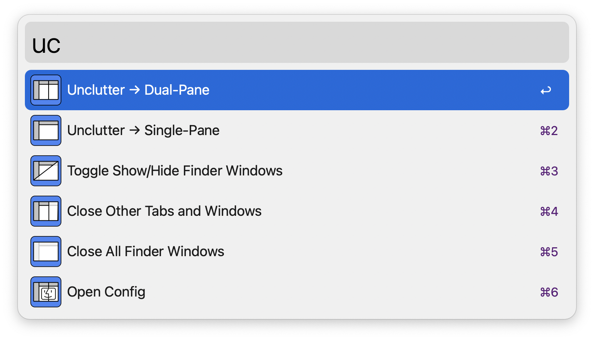
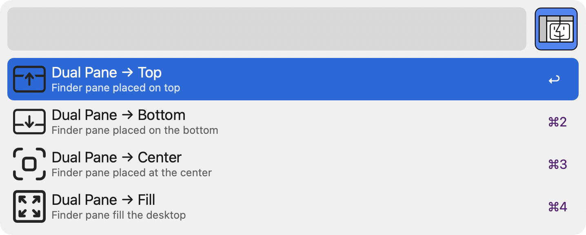
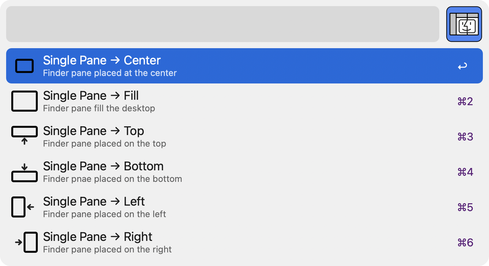
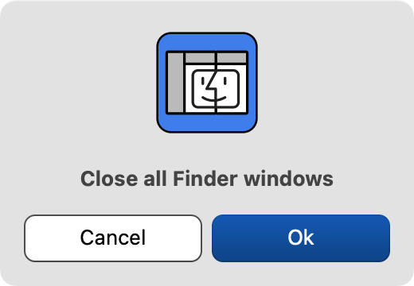
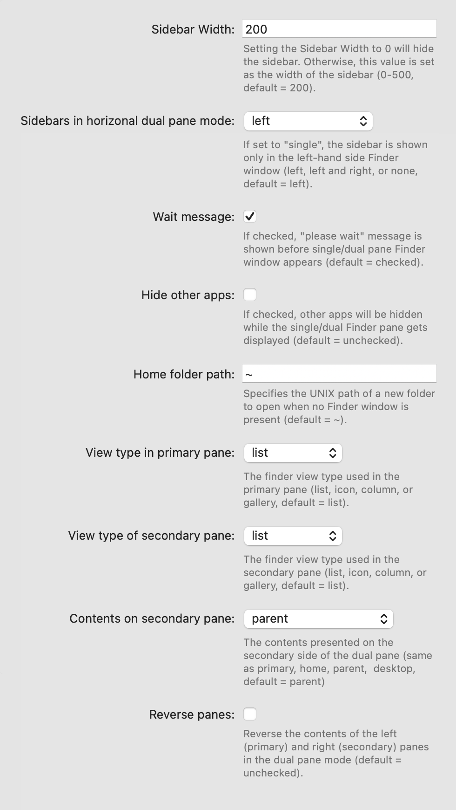

# Finder Unclutter

An Alfred 🎩 workflow that removes duplicate Finder tabs and windows and arranges them into a single or dual-pane 👓 layout for a cleaner desktop experience 🖥️ 🧹


**Finder Unclutter** does the following all at once:

- **Unminimize** all Finder windows
- **Unduplicate** all Finder tabs
- **Merge** all Finder windows and tabs
- **Organize** Finder in a single/dual pane layout
- **Position** Finder in a specified area of the desktop




## Requirements

- [Alfred 5](https://www.alfredapp.com/) with Powerpack

This workflow has been developed and tested on macOS Sonoma and macOS 26 Tahoe. Finder may be set to any language.

## Installation

To install, download [Finder Unclutter Alfred Workflow](https://github.com/yohasebe/finder-unclutter/raw/main/finder-unclutter.alfredworkflow) (version 2.0)

## Change Log

- 2.0 (2026-08-09)
  - **Finder no longer has to be set to English.** Tabs are now built with Finder's own New Tab shortcut instead of the localised "Merge All Windows" menu item, so merging works in any language. The language-switching prompt and the `defaults write com.apple.Finder AppleLanguages` step have been removed.
  - **Windows are laid out on the display they are already on**, instead of always on the primary display.
  - **The Dock and the menu bar are excluded properly.** Screen geometry now comes from `NSScreen.visibleFrame` rather than a hard-coded 37px menu bar, so windows no longer sit under the Dock or overhang the bottom of the screen.
  - **Much faster.** `system_profiler` -- which took seconds on the first run after a reboot -- is gone, and re-running on an already tidy window is now a no-op. The "first call may take longer" notice is no longer needed.
  - Fixed: the secondary pane ignored its own view type in the side-by-side layout.
  - Fixed: in the stacked layout, the `single` / `none` sidebar settings and `reverse` had no effect.
  - Fixed: "Hide other apps" never did anything.
  - Fixed: a bad Home Folder setting reported the error and then failed again in the middle of arranging windows.
  - Fixed: "Close Other Tabs and Windows" could loop forever on a window that would not close.
  - Panes are now sized after their sidebar is applied, so a narrow pane is no longer padded out by the previous run's sidebar.
  - The "please wait" overlay is now off by default; the operation it covered no longer takes long enough to need it.
  - The AppleScript sources live in `source/scripts/` and are injected into `info.plist` by `tools/build.py`.
- 1.8 (2025-10-26)
  - Added configurable delays to AppleScript operations for improved stability
  - Delay timings can be adjusted via environment variables
- 1.7 (2025-09-22)
  - Center horizontal dual-pane layout now balances both panes by offsetting the left pane with the measured Finder sidebar width.
  - Smart Folder tabs are preserved while transient search results remain excluded when windows are rebuilt.
- 0.1.6 (2025-02-04)
  - Show Desktop menu item added

## macOS Permissions

On first run macOS prompts for automation access. Approve the dialogs for **Alfred** so it can control **Finder** and **System Events**. If the prompts were dismissed, open `System Settings → Privacy & Security` and enable:

- `Accessibility`: allow Alfred to control the computer.
- `Automation`: under Alfred, check Finder and System Events.

Finder can be set to any language; the workflow does not read or change your language settings.

## Troubleshooting

- Folders end up in separate windows instead of tabs: this is the fallback the workflow takes when Finder does not respond to the New Tab shortcut in time. Raise `delay_window_operation` so Finder gets longer to settle, and check that Alfred is still listed under `Privacy & Security → Accessibility`.
- Windows do not merge completely: increase `delay_window_operation` so Finder has more time to load slow network or external volumes.
- Automation prompts reappear or automation steps fail: recheck Alfred under `Privacy & Security → Accessibility` and `Automation`, then restart Alfred and Finder.

## Features

Each feature can be assigned a unique hotkey for quick access.

####  Unclutter → Dual-Pane

Organizes Finder tabs/windows into a double-pane Finder window. All existing tabs are collected in the primary pane.

The secondary pane will contain only one tab that displays the user-specified contents (`same as primary`, `parent`, `desktop`, or `home`).

The dual Finder pane can be placed in either `center (horizontal)`, `center (vertical)`, `fill (horizontal)`, `fill (vertical)`, `left`, `right`, `top`, or `bottom`. You can either specify the area either by using hotkeys, or by selecting one on running the workflow.



####  Unclutter → Single-Pane

Finder tabs/windows will be organized into a single Finder window. All existing tabs will be collected in this Finder window.

The dual Finder pane can be placed in either `center`, `fill`, `left`, `right`, `top`, or `bottom`. You can either specify the area either by using hotkeys, or by selecting one on running the workflow.



####  Toggle Show/Hide Finder Windows

This feature relies on Alfreds `toggle visibility` feature.

####  Close Other Tabs and Windows

This will close all the non-current Finder tabs and windows.

####  Close All Finder Windows

This will close all the Finder tabs and windows including the current one. A confirmation dialog pops up.



####  Show Desktop

Show Desktop using Mission Control's "Show Desktop" feature. Use the `show_desktop_keycode` environment variable if you want to change the default key code (`103`).

####  Open Config

For details on each of the configurable parameters, see [below](#configuration).



## Configuration

#### Sidebar Width

Setting the Sidebar Width to 0 will hide the sidebar. Otherwise, this value is set as the width of the sidebar (`0-500`, default = `200`).

#### Sidebars in dual pane mode

`single` shows the sidebar in the leading pane only -- the left one in a side-by-side split, the top one in a stacked split -- and widens that pane by half the sidebar width so both file lists come out the same size. `double` gives both panes a sidebar, `none` gives neither (default = `single`).

#### Home folder path

Specifies the UNIX path of a new folder to open when no Finder window is present (default = `~`).

#### View type in primary pane

The finder view type used on the primary pane (`list`, `icon`, `column`, or `gallery`, default = `list`).


#### View type of secondary pane

The finder view type used on the secondary pane (`list`, `icon`, `column`, or `gallery`, default = `list`).

#### Contents on secondary pane

The contents presented on the secondary pane (`same as primary`, `home`, `parent`,  `desktop`, default = `parent`)

#### Wait message

If checked, an "uncluttering" overlay is shown while the single/dual pane is being arranged (default = `unchecked`). Since version 2.0 the layout is fast enough that the overlay is mostly a flash on screen.

#### Hide other apps

If checked, other apps will be hidden while the single/dual Finder pane gets displayed (default = `unchecked`).

#### Reverse panes

Reverse the contents of the primary (left/top) and secondary (right/bottom) panes in the dual pane mode (default = `unchecked`).

## Environment Variables

- `show_desktop_keycode`: The keycode of the key assigned to Mission Control's "Show Desktop" (default = `103`).
- `wait_in_seconds`: Delay between steps when arranging the dual-pane layout (default = `0.1`). Increase if network drives or external volumes don't load in time.
- `delay_system_events_launch`: Delay after launching System Events before GUI operations (default = `0.2`). Increase if the New Tab shortcut is sometimes missed.
- `delay_window_operation`: Delay after window open/close operations (default = `0.2`).
- `delay_menu_operation`: Kept for compatibility; no longer used now that tab creation waits for Finder rather than sleeping.

## Development

The AppleScript sources are the files in `source/scripts/`; `source/info.plist` is a build artifact that carries a copy of each of them. `--#include lib/…` lines are expanded at build time.

```bash
python3 tools/build.py              # inject source/scripts/ into source/info.plist
python3 tools/build.py --package    # also write finder-unclutter.alfredworkflow
python3 tools/build.py --install    # also copy info.plist into the live Alfred workflow
python3 tools/extract.py            # pull scripts back out after editing inside Alfred
```

`tools/manifest.json` maps each Alfred Run Script object's uid to its file, and the build fails if a Run Script object has no entry.

## Author

Yoichiro Hasebe yohasebe@gmail.com

## License

MIT License
