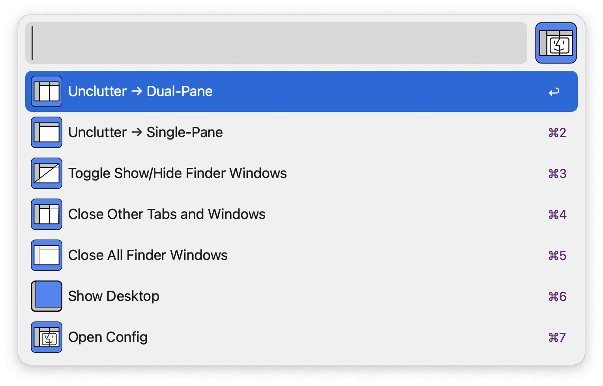
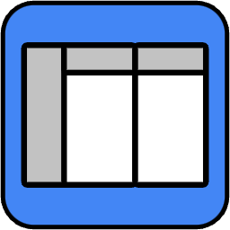
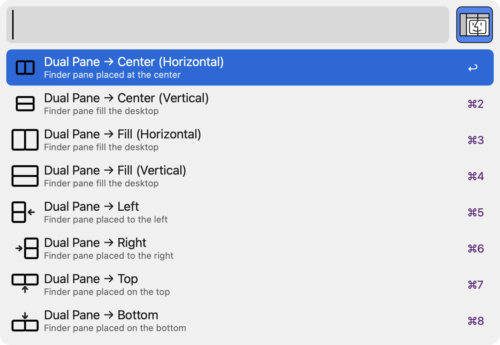

# Finder Unclutter

An Alfred 🎩 workflow that removes duplicate Finder tabs and windows and arranges them into a single or dual-pane 👓 layout for a cleaner desktop experience 🖥️ 🧹

**Finder Unclutter** does the folloing all at once:

- **Unminimize** all Finder windows
- **Unduplicate** all Finder tabs
- **Merge** all Finder windows and tabs
- **Organize** Finder in a single/dual pane layout
- **Position** Finder in a specified area of the desktop

## Requirements

- [Alfred 5](https://www.alfredapp.com/) with Powerpack
- Finder.app with `language` set to `English`

> **IMPORTANT**: This Workflow only functions properly if the language setting of **Finder.app** is set to **English** due to the way it interacts with Finder's interface. You must either select English in `Language & Region / Preferred Languages`, or set the language setting of Finder.app to English in `Language & Region / Applications`. A system restart may be required after changing these settings.

This workflow has been developed and tested on macOS Sonoma 14.3.

## Installation

To install, download [Finder Unclutter Alfred Workflow](https://github.com/yohasebe/finder-unclutter.alfredworkflow) (version 0.1.0)

## Features

Each feature can be assigned a unique hotkey for quick access.

####  Unclutter → Dual-Pane

Organizes Finder tabs/windows into a double-pane Finder window. All existing tabs are collected in the primary pane.

The secondary pane will contain only one tab that displays the user-specified contents (`same as primary`, `parent`, `desktop`, or `home`).

The dual Finder pane can be placed in either `center`, `top`, `bottom`, or `fill`. You can either specify the area by either setting the config, using hotkeys, or selecting one on running the workflow.

####  Unclutter → Single-Pane

Finder tabs/windows will be organized into a single Finder window. All existing tabs will be collected in this Finder window.

The dual Finder pane can be placed in either `center`, `top`, `left`, `right`, `bottom`, or `fill`. You can either specify the area by either setting the config, using hotkeys, or selecting one on running the workflow.

####  Toggle Show/Hide Finder Windows

This feature relies on Alfreds `toggle visibility` feature.

####  Close Other Tabs and Windows

This will close all the non-current Finder tabs and windows.

####  Close All Finder Windows

This will close all the Finder tabs and windows including the current one. A confirmation dialog pops up.

####  Open Config

For details on each of the configurable parameters, see [below](#configuration).

## Configuration

#### Sidebar Width

Setting the Sidebar Width to 0 will hide the sidebar. Otherwise, this value is set as the width of the sidebar (`0-500`, default = `200`).

#### Sidebars in dual pane mode

If set to `single`, the sidebar is shown only in the left-hand side Finder window (default = single). If set to `double`, the dual pane window will look like this

#### Single pane window position

Area of the desktop in which Finder window in single pane mode from `selectable`, `center`, `top`, `bottom`, `left`, `right` or `fill` (default = `selectable`).

#### Dual pane window position

Area of the desktop in which Finder window in dual pane mode from `selectable`, `center`, `top`, `bottom`, or `fill` (default = `center`).

#### Home folder path

Specifies the UNIX path of a new folder to open when no Finder window is present (default = `~`).

#### View type in primary pane 

The finder view type used on the primary pane (`list`, `icon`, `column`, or `gallery`, default = `list`).

#### View type in secondary pane

The finder view type used on the secondary pane (`list`, `icon`, `column`, or `gallery`, default = `list`).

#### Folder on the right side in dual pane mode

The contents presented on the right-hand side of the dual pane (`same as left`, `home`, `parent`,  `desktop`, default = `parent`)

#### Wait message

If checked, "uncluttering" message is shown before single/dual pane Finder window appears (default = `checked`).

#### Hide other apps

If checked, other apps will be hidden while the single/dual Finder pane gets displayed (default = `unchecked`).

#### Reverse panes

Reverse the contents of the primary (left) and secondary (right) panes in the dual pane mode (default = `unchecked`).

## Author

Yoichiro Hasebe yohasebe@gmail.com

## License

MIT License
